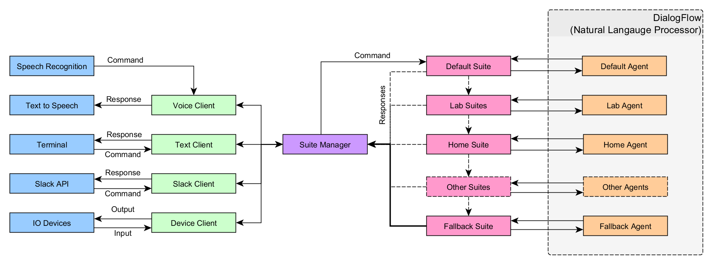

# Lab-Assistant

## Project Purpose
</img>

The purpose of this project is to create a virtual assistant to assist SPARC members.  SPARC stands for <a href = "http://sparc-auburn.github.io/">Student Projects and Research Committee</a> and is a student led organization in the Department of Electrical Engineering at Auburn University.  The virtual assistant will be fully featured including abilities to help in the lab to automating a home. It will include a system that allows for easy to use management of lab equipment and various administrative features.  The virtual assistant could also be integrated on a mobile robotic platform to allow more capabilities that a static computing platform could.  Our current iteration of the virtual assistant is named Karen.
## Project Overview
</img>

This project is programmed in Python.  Python provides a simple yet powerful back end to run the assistant.  The assistant can be run through several clients as outlined below to adapt to the various use cases.  Suites are used to manage the intelligence of the assistant and can be turned on and off to allow flexibility.  User commands are passed in from the clients through a suite manager python file.  The suite managers loop through all of the suites to find the appropriate response and returns it back to the client.  The suites communicate with a natural language processor named DialogFlow as described in more detail below.
### Assistant Clients
* Voice Client - Uses a microphone to take input from the user and speaks response back to user.
* Text Client - Uses the terminal to allow user to type commands and receive responses.
* Slack Client - Uses Slack messaging app to allow SPARC members to type commands and receive responses.
* Device Client - Communicates with the other clients for device control on less powerful computing platforms.
### Suites
1. Default - A collection of basic responses.
1. Lab - A collection of responses and functions pertaining to assisting users in the SPARC lab.
1. Home - A collection of responses and functions pertaining to home automation and light control.
1. Weather - A collection of responses and functions pertaining to processing weather commands.
1. Personal - A collection of functions pertaining to personal commands like reminders, time, and alarms.
1. Knowledge - A collection of functions to search Google, Bing, Wolfram Alpha, Wikipedia, or etc.
1. Fallback - A collection of fallback responses if previous suites did not catch.
### DialogFlow
</img>

To help give the virtual assistant the ability to understand the English language, we are using a Google owned service called DialogFlow.  It is a natural language processor in which it deconstructs user inputs into intents (meaning) and entities (specifics).  Through customization and training, a machine learning algorithm can be tuned to allow the assistant to more intelligently communicate.

The DialogFlow documentation walks through an example of how it works: https://dialogflow.com/docs/getting-started/basics
## Running the Assistant
### Run Voice Client on PC using PyCharm (Windows, Ubuntu, etc.)
</img>

PyCharm is a fully featured free Python IDE.  It provides a powerful development studio for Python code.  It can run Python programs in the same windows as the code is developed and integrates with git to allow a seemless experience.  Another nice feature of PyCharm is the intelligent refactoring so that variables, classes, and even file names can be efficiently changed throughout the entire program.
1. Install PyCharm Community Edition: https://www.jetbrains.com/pycharm/download/#section=windows
1. Install Python 2.7.13: https://www.python.org/downloads/release/python-2713/.  (Make sure that add to path is checked on Windows)
1. Install git bash https://git-for-windows.github.io/.
1. Clone directory into desired location using `git clone "https://github.com/SPARC-Auburn/Lab-Assistant"` in git bash.
1. In PyCharm, press `File > New Project...`
1. Press "..." button and navigate to cloned directory. Press "OK" and "Create"
1. Press `File > Settings... > Project: Lab-Assistant > Project Interpreter`
1. Change the Project Interpreter to be `Python27/python.exe`
1. Press the green "+" button and add any Python libraries that are missing and press "OK".
1. Plug in USB mic if computer does not have an integrated microphone.
1. In the tree on the left, press `voice_karen.py` under the assistant folder.
1. Start the voice client by running `python voice_client.py` by right clicking in the center of the screen and pressing `Run voice_client.py`
1. Karen should now respond to your requests. (How are you?, Tell me a joke., etc.)
1. If you need to stop the program press the red square in the toolbar.

## Run Voice Client on PC or Raspberry Pi 2 or 3 using Debian Linux (Raspbian, Ubuntu, etc.)
</img>

1. Make sure installation is updated by running the following commands (This may take a long while):
    ```
    sudo apt-get update
    sudo apt-get upgrade
    sudo -H pip install --upgrade pip
    ```
1. Clone directory into desired location using `git clone "https://github.com/SPARC-Auburn/Lab-Assistant"`
1. Run installation script using:
    ```
    chmod +x ./install.sh
    sudo -H ./install.sh
    ```
1. Change directory to `assistant`.
1. Plug in USB mic if computer does not have an integrated microphone.
1. Start the voice client by running `python voice_client.py`
1. Karen should now respond to your requests. ("How are you?, Tell me a joke., etc.)
1. If you need to stop the program use "CTRL-SHIFT-\".

## Contributing to the Project
Please see the <a href="CONTRIBUTING.md">CONTRIBUTING.md</a> document in this repository for recommendations on how to contribute.
### How to Create Suites
Suites are the best way to add your own, custom functions into the Assistant framework.  There are only a few requirements for suites to be imported and used:
1. There must be a class that is the same as the file name in camel case notation. (ie. defaultsuite - class DefaultSuite)
1. The class must have an __init__ and checkcommand() function.  Use defaultsuite.py as a template.
1. Replace the "CLIENT_ACCESS_TOKEN" with the CLIENT_ACCESS_TOKEN from DialogFlow's corresponding agent.
1. Add additional recognition under the elif statement.
To hook your method into the program, import the suite in manage_suites.py like `from suites.newsuite import *`.  Add your suite to the suites array to be included in the processing of commands.
